# UI Screens

All 15 interactive UI screens. Every tool has a visual representation.

## Tool → UI Mapping

| Tool | Default UI | Resource URI |
|------|-----------|-------------|
| `list-events` | Upcoming Events | `ui://gcal/upcoming` |
| `search-events` | Agenda | `ui://gcal/agenda` |
| `get-event` | Event Detail | `ui://gcal/event-detail` |
| `create-event` | Event Form | `ui://gcal/event-form` |
| `create-events` | Bulk Create | `ui://gcal/bulk-create` |
| `update-event` | Event Form | `ui://gcal/event-form` |
| `delete-event` | Delete Confirm | `ui://gcal/delete-confirm` |
| `respond-to-event` | RSVP Confirm | `ui://gcal/rsvp-confirm` |
| `get-freebusy` | Availability | `ui://gcal/freebusy` |
| `get-current-time` | Clock | `ui://gcal/clock` |
| `list-calendars` | Calendar List | `ui://gcal/calendar-list` |
| `list-colors` | Color Palette | `ui://gcal/colors` |
| `manage-accounts` | Account Manager | `ui://gcal/accounts` |

Plus 3 alternate views (built but not default for any tool):
- **Day View** (`ui://gcal/day-view`) — 24h vertical timeline
- **Week View** (`ui://gcal/week-view`) — 7-column grid
- **Month View** (`ui://gcal/month-view`) — Monthly calendar grid

## Calendar Views

### Upcoming Events
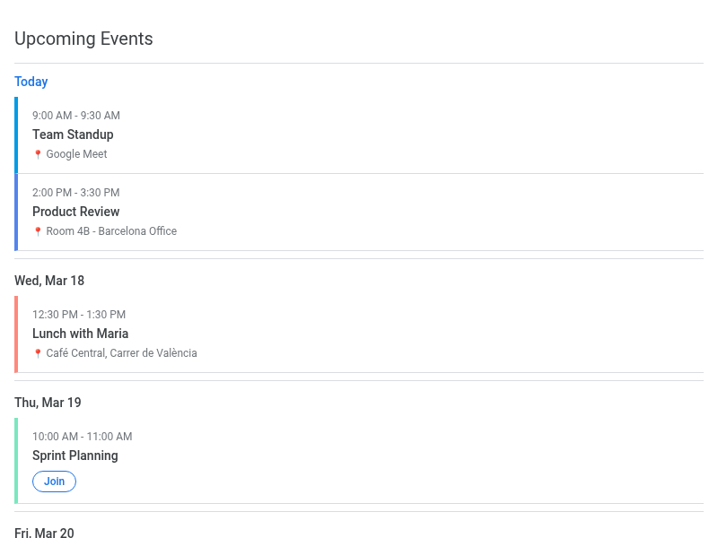

Default view for `list-events`. Events grouped by day with colored cards.

- Day headers with relative labels ("Today", "Tomorrow", "Wed, Mar 18")
- Event cards: left color bar, time range, title, location
- All-day event support
- "Join" button for video meetings
- "Load more" pagination
- Auto-fetches from primary calendar if called with empty input

### Day View
24-hour vertical timeline.

- 48px/hour grid with event blocks positioned by time
- Overlapping event column layout
- Current time red line indicator (auto-updates)
- All-day events banner at top
- Click event → detail popup
- Prev/Next day navigation + "Today" button

### Week View
7-column grid (Sun–Sat).

- All-day event banner row
- Today's column highlighted with blue tint
- Event overlap handling per column
- Current time indicator in today's column
- Week navigation (prev/next)

### Month View
Traditional monthly calendar grid.

- Colored event pills (max 3 per cell)
- "+N more" overflow links
- Today's date in blue circle
- Days outside current month dimmed
- Click day → event popup
- Month navigation + "Today" button

### Agenda
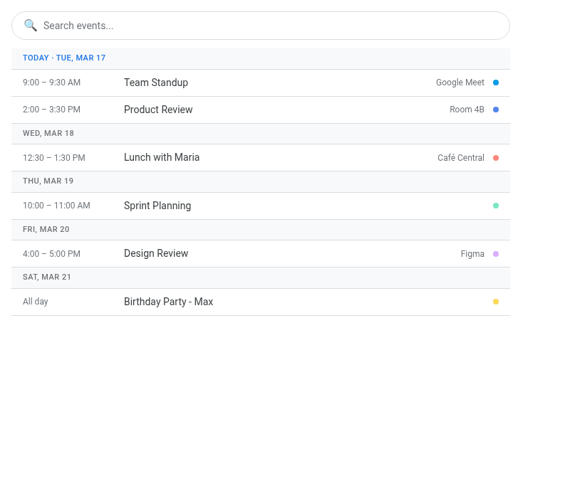

Searchable event list for `search-events`.

- Search bar with 500ms debounce
- Date range filter (start/end inputs)
- Events grouped by day with sticky headers
- Compact row format: time | title | location | color dot
- Click-to-expand inline details
- Keyboard navigation (arrow keys + Enter)

### Free/Busy Availability
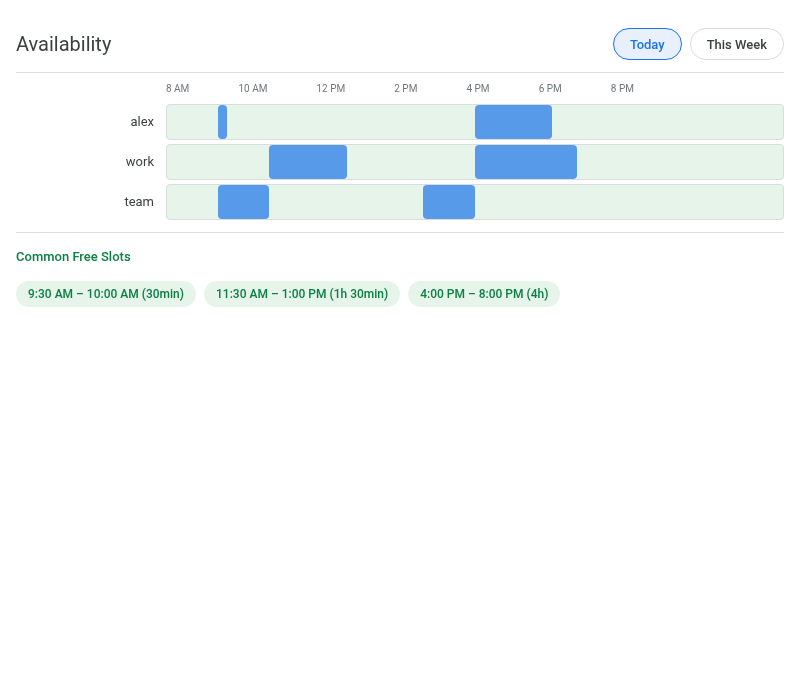

Visual availability for `get-freebusy`.

- Horizontal timeline bars per calendar
- Busy blocks (blue) over free background (green)
- Hover tooltips on busy periods
- Common free slot detection and highlighting
- Range selectors: Today / This Week / Custom

## Event Management

### Event Detail
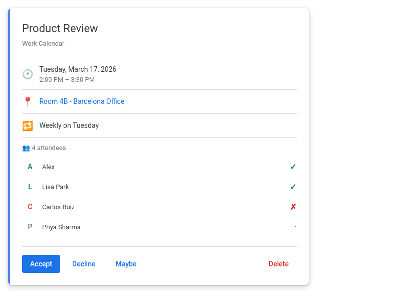

Full event card for `get-event`.

- Left color strip (4px)
- Date/time, location (→ Maps link), description
- Attendee list with RSVP status (✓ accepted, ✗ declined, ? tentative)
- "Join Meeting" button for Google Meet / video links
- Action buttons: Accept, Decline, Maybe, Delete
- Recurrence info with human-readable RRULE parsing

### Event Form
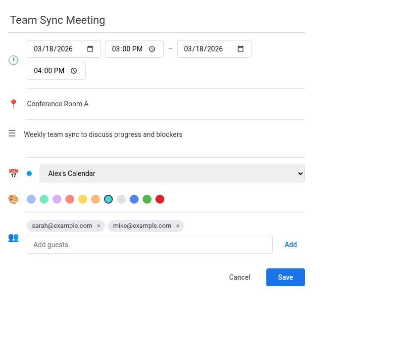

Creation/edit form for `create-event` and `update-event`.

- Title input (22px, Google Calendar style)
- Date/time pickers with all-day toggle
- Calendar selector dropdown (fetched from `list-calendars`)
- Color picker with selection ring
- Attendee input with email validation and chips
- Recurrence dropdown (None / Daily / Weekly / Monthly / Yearly)
- Location and description fields

### Delete Confirmation
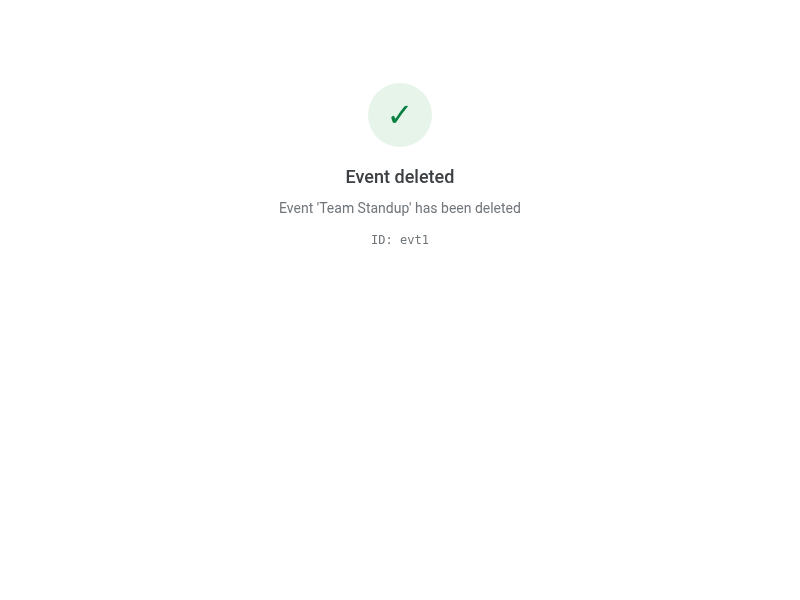

For `delete-event`. Shows success or error state with animated icon.

### RSVP Confirmation
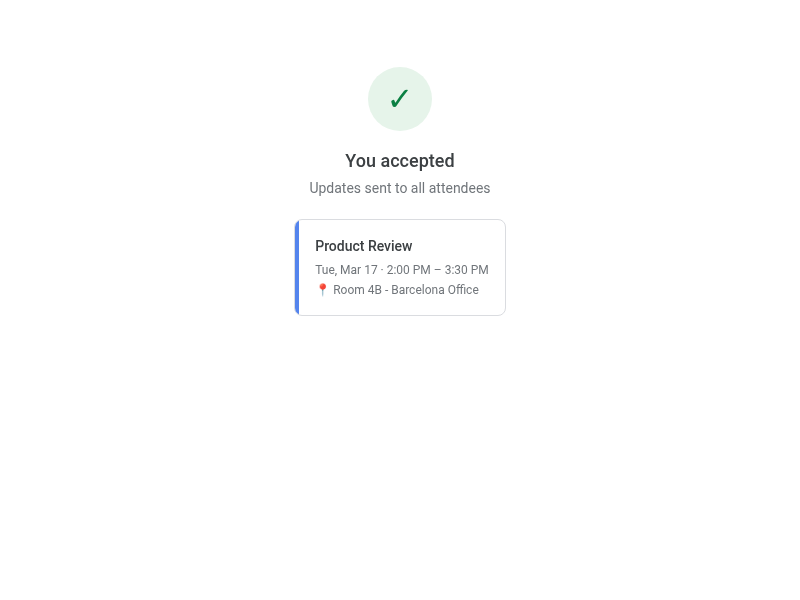

For `respond-to-event`. Shows response status with event summary card.

### Bulk Create Progress
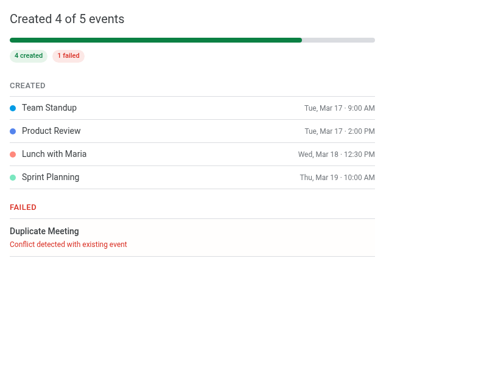

For `create-events`. Progress bar with per-event success/failure.

## Utilities

### Calendar List
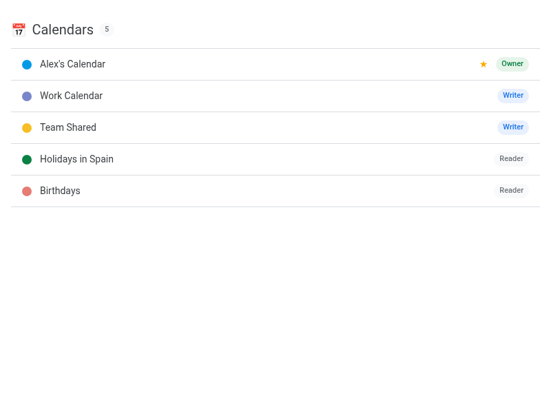

For `list-calendars`. All calendars with color swatches and access roles.

### Color Palette
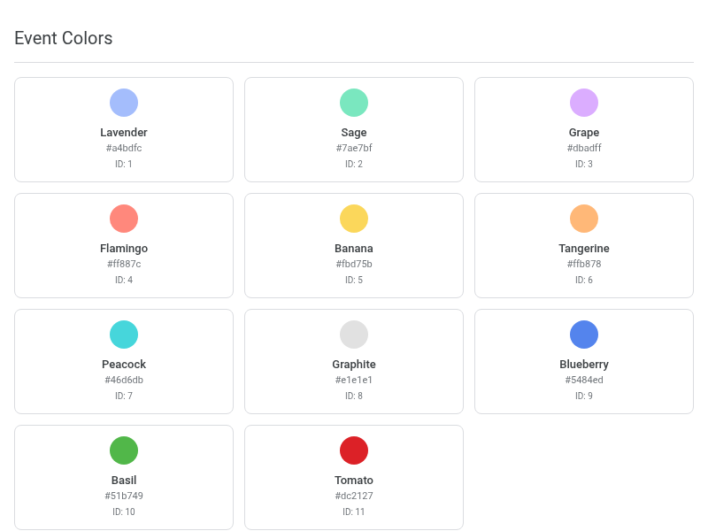

For `list-colors`. Event and calendar color grids with names and hex values.

### Clock / Timezone
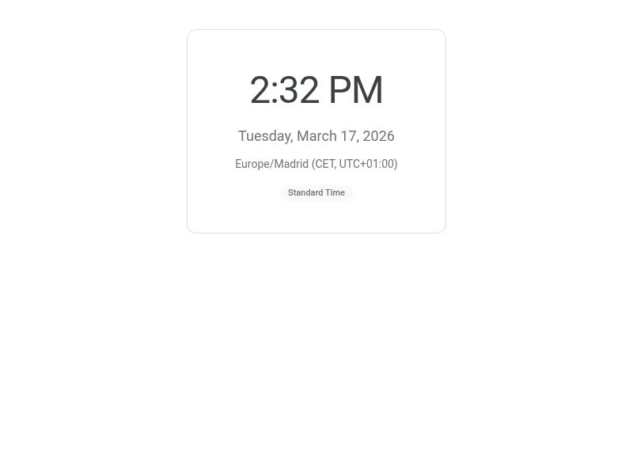

For `get-current-time`. Digital clock with timezone and DST info.

### Account Manager
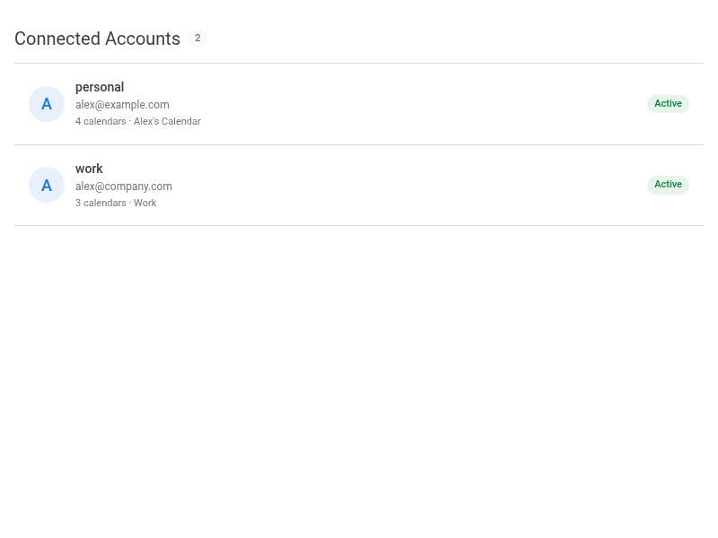

For `manage-accounts`. Connected accounts with status badges.
